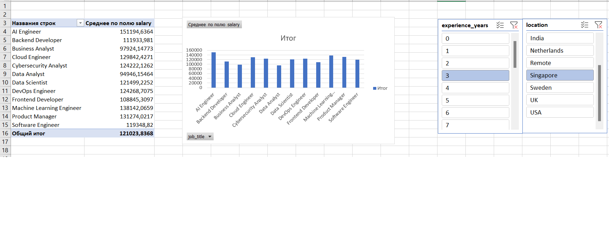

📊 Job Salary Analysis Dashboard (2024-2025)

Ushbu loyihada 250,000 dan ortiq ma'lumotlar tahlil qilinib, kasblar va ish tajribasi bo'yicha Interaktiv Dashboard yaratildi.

✅ Qilingan ishlar:
* Ma'lumotlarni tozalash: Excel orqali 250k+ qatorli xom ma'lumotlar tartibga solindi.
* Pivot Table: O'rtacha oyliklar va kasblar bo'yicha tahlil qilindi.
* Interaktivlik: Davlatlar va tajriba yillari bo'yicha Slicer (filtrlar) qo'shildi.

📈 Yakuniy Dashboard:

📁 Loyiha fayllari:
* job_salary_prediction_dataset.csv — Ma'lumotlar.
* job_salary_report.png — Tahlil natijasi (Rasm).
